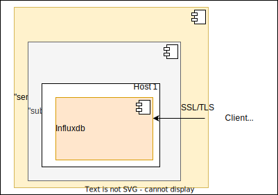

# Ansible playbook: labocbz.deploy_influxdb


## Description


An Ansible playbook to deploy and configure Influxdb on your host.

This playbook simplifies the installation of InfluxDB along with its bundled web interface. You can easily configure the database service to bind to a specific network interface, enhancing security. Furthermore, the playbook allows for seamless integration with an Apache2 reverse proxy frontend, offering an optimal configuration for InfluxDB.

With this playbook, you can effortlessly set up and configure InfluxDB, ensuring that it operates securely and efficiently, while providing the option to customize its network interface and integrate it seamlessly with Apache2 for web-based access.

## Deployment diagramm



This demonstrates a potential deployment carried out using this playbook. We can observe an InfluxDB service component. This service component encompasses a subsystem, housing the two core components of our service Influxdb. SSL/TLS is enabled and clients can use the service.

## Tests and simulations

### Basics

You have to run multiples tests. *tests with an # are mandatory*

```MARKDOWN
# lint
# syntax
# converge
# idempotence
# verify
side_effect
```

Executing theses test in this order is called a "scenario" and Molecule can handle them.

Molecule use Ansible and pre configured playbook to create containers, prepare them, converge (run the playbook) and verify its execution.
You can manage multiples scenario with multiples tests in order to get a 100% code coverage.

This playbook contains a ./tests folder. In this folder you can use the inventory or the tower folder to create a simualtion of a real inventory and a real AWX / Tower job execution.

### Command reminder

```SHELL
# Check your YAML syntax
yamllint -c ./.yamllint .

# Check your Ansible syntax and code security
ansible-lint --config=./.ansible-lint .

# Execute and test your playbook
molecule lint
molecule create
molecule list
molecule converge
molecule verify
molecule destroy

# Execute all previous task in one single command
molecule test
```

## Installation

To install this playbook, just copy/import this playbook or raw file into your fresh playbook repository or call it with the "include_playbook/import_playbook" module.

## Usage

### Vars

```YAML
# From inventory
---
# all vars from to put/from your inventory
# see tests/inventory/group_var for all groups and vars.
```

```YAML
# From AWX / Tower
---
all vars from to put/from AWX / Tower
```

## Architectural Decisions Records

Here you can put your change to keep a trace of your work and decisions.

### 2023-10-16: First Init

* First init of this playbook with the bootstrap_playbook playbook by Lord Robin Crombez

### 2023-10-20: Fix and Push

* Playbook deploy Influxdb
* Apache2 can be installed as reverse proxy SSL / Auth
* WAF, LDAP, QOS can be handled

### 2023-11-24: No more Apache2

* Inlfux use HTTP/HTTP API so put an reverse proxy WAF before is not a good idea ...

### 2023-12-16: System users

* Role can now create system users and address groups
* Added certs of 10 years

### 2023-12-18: Free strategy and vars

* Reorganize test
* Disable remote use setting and free strategy
* Rename vars for certs

### 2024-03-02: Remastered

* Imported new CICD
* Rework global on readme
* Rename of vars __ and refacto

## Authors

* Lord Robin Crombez

## Sources

* [Ansible playbook documentation](https://docs.ansible.com/ansible/latest/playbook_guide/playbooks_reuse_playbooks.html)
* [Ansible Molecule documentation](https://molecule.readthedocs.io/)
* [labocbz.install_influxdb](https://github.com/CBZ-D-velop/Ansible-Role-Labocbz-Install-Influxdb.git)


/etc/influxdb/ssl/clu-influxdb.net3106.databases.labo-cbz.net/clu-influxdb.net3106.databases.labo-cbz.net.pem.crt
/etc/influxdb/ssl/clu-influxdb2.net3106.databases.labo-cbz.net/clu-influxdb2.net3106.databases.labo-cbz.net.pem.crt